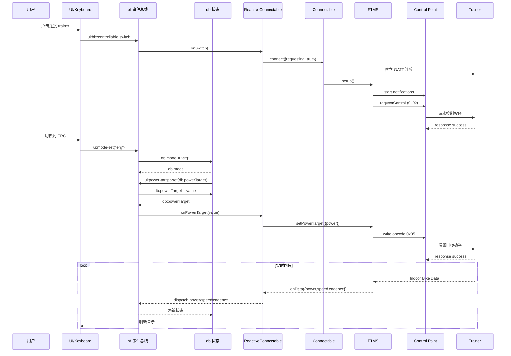

# Auuki 项目整体结构与物理模型分析

## 文档目的

本文档用于梳理 **Auuki** 项目的整体架构、智能骑行台控制链路、ERG 模式时序，以及项目中的物理功率/坡度模型实现细节，便于在后续项目中做：

- 架构参考
- 物理模型迁移
- 训练台控制流程复用
- 来源注明与合规记录

---

## 来源与归属说明

### 开源项目来源

- 项目名称：**Auuki**
- 仓库来源：**https://github.com/dvmarinoff/Auuki**
- 当前分析对象：本地仓库 `Auuki`

### 需要在后续项目中保留的来源说明

如果后续项目参考了本项目的设计、结构、协议封装方式、事件流，或者直接复用了本项目代码，建议在你的项目文档中至少注明：

> 本项目的智能骑行台控制结构、部分物理模型分析、以及协议实现思路参考自开源项目 **Auuki**（https://github.com/dvmarinoff/Auuki）。

如果直接复制或修改了源代码，建议再补充：

> 原始来源仓库：Auuki，作者与版权信息请参见原仓库与许可证文件。

### 许可证记录

根据仓库根目录的 `LICENSE.txt`，Auuki 采用：

- **GNU Affero General Public License v3.0**

这意味着：

- 如果只是阅读、学习、做内部技术分析，通常没有问题
- 如果你的后续项目直接复制、修改并对外提供网络服务，通常需要特别关注 **AGPL** 的源码开放义务
- 如果后续项目是商业项目或闭源项目，建议在真正复用代码前做一次正式许可证评估

本文档只做技术归纳，不构成法律意见。

### 额外来源记录

`src/physics.js` 顶部注明了三次方程求解器 `Qubic()` 的来源：

- Source: https://stackoverflow.com/questions/27176423/function-to-solve-cubic-equation-analytically

因此如果后续项目直接沿用该求根实现，也建议在代码或技术文档中保留这一来源说明。

---

## 一、项目整体定位

Auuki 是一个基于浏览器的室内骑行训练应用，核心能力包括：

- 连接智能骑行台、功率计、心率带等设备
- 支持 **ERG / Grade Simulation / Resistance** 控制模式
- 执行结构化训练
- 基于课程坡度做坡度驱动
- 记录活动数据并导出 `.FIT`

项目特点：

- 运行在浏览器中
- 使用 **Web Bluetooth**
- 大量使用 **自定义事件总线**
- UI 主要由 **Web Components** 组成
- 设备控制与业务状态通过中心化 `db` 解耦

---

## 二、整体架构分层

从职责上可以把 Auuki 分成 6 层。

### 1. 视图层

负责：

- 用户输入
- 按钮/标签页切换
- 目标功率、阻力、坡度调节
- 数据展示

关键目录：

- `src/views/`
- `src/index.html`

典型模块：

- `src/views/tabs.js`
- `src/views/data-views.js`
- `src/views/keyboard.js`

### 2. 事件总线层

负责：

- UI 事件分发
- 数据库状态变更通知
- 模块间解耦

关键文件：

- `src/functions.js`

核心对象：

- `xf`

机制特点：

- `xf.dispatch(eventType, payload)` 发送事件
- `xf.sub(eventType, handler)` 订阅事件
- `xf.reg(eventType, handler)` 注册对状态对象 `db` 的写操作
- `xf.create(db)` 使用 `Proxy` 包装 `db`，属性写入时自动派发 `db:*` 事件

### 3. 全局状态层

负责：

- 持有当前训练状态
- 持有模式和目标值
- 持有实时功率/速度/踏频/距离/海拔等数据

关键文件：

- `src/db.js`
- `src/models/models.js`

典型状态项：

- `db.mode`
- `db.powerTarget`
- `db.resistanceTarget`
- `db.slopeTarget`
- `db.power`
- `db.speed`
- `db.distance`
- `db.altitude`
- `db.ascent`

### 4. BLE/Trainer 接入层

负责：

- 扫描并连接蓝牙设备
- 识别设备支持的协议
- 初始化控制服务与通知特征
- 统一暴露 trainer 控制接口

关键文件：

- `src/ble/connectable.js`
- `src/ble/reactive-connectable.js`
- `src/ble/devices.js`

### 5. 协议适配层

负责把统一 trainer 接口翻译为不同协议命令。

支持的主要控制协议：

- **FTMS**
- **FEC over BLE**
- **Wahoo WCPS**

关键文件：

- `src/ble/ftms/ftms.js`
- `src/ble/fec/fec.js`
- `src/ble/wcps/wcps.js`

### 6. 物理模型层

负责：

- 功率推导虚拟速度
- 根据坡度积分距离/海拔/爬升
- 用真实速度配合坡度计算路线进展

关键文件：

- `src/physics.js`
- `src/models/models.js`
- `src/course.js`

---

## 三、训练台控制的统一抽象

Auuki 上层并不关心 trainer 具体使用 FTMS、FEC 还是 Wahoo 扩展协议。它在业务上只关心三类统一命令：

- `setPowerTarget({ power })`
- `setResistanceTarget({ resistance })`
- `setSimulation({ grade })`

也就是说，业务层抽象的是“控制意图”，协议层负责把“控制意图”编码为不同协议的数据包。

这是一种非常适合迁移的设计方式：

- 上层统一
- 下层多协议适配
- 不同 trainer 可以共享业务逻辑

---

## 四、设备控制服务选择逻辑

`src/ble/connectable.js` 中的 `defaultSetup()` 会在设备连接成功后检查服务列表，并只选择一个 trainer 控制服务。

选择顺序：

1. FTMS
2. FEC over BLE
3. Wahoo WCPS

这么做的原因是：

- 某些 trainer 同时暴露多个控制服务
- 如果同时初始化并同时写控制命令，可能会造成阻力抖动或冲突

因此 Auuki 在架构上明确采用：

- **只保留一个 `services.trainer`**

这对后续项目非常有参考价值：  
如果你的项目也要兼容多个 trainer 协议，建议在运行时只激活一个控制通道。

---

## 五、模式系统：ERG / Resistance / Sim

Auuki 的模式定义位于：

- `src/ble/enums.js`

模式枚举：

- `erg`
- `sim`
- `resistance`
- `virtualGear`

其中当前项目真正使用的主要是前三个。

### 1. ERG

语义：

- 给 trainer 一个目标功率
- trainer 内部自行调节阻力，使实时功率接近目标功率

Auuki 负责：

- 维护 `db.powerTarget`
- 在 ERG 模式下发送 `setPowerTarget`

trainer 负责：

- 做功率闭环控制

### 2. Resistance

语义：

- 给 trainer 一个阻力级别或阻力强度
- 功率由用户踏频/速度决定

Auuki 负责：

- 维护 `db.resistanceTarget`
- 在 Resistance 模式下发送 `setResistanceTarget`

### 3. Sim

语义：

- 按坡度模拟骑行阻力
- 同时驱动本地路线/海拔/虚拟速度计算

Auuki 负责：

- 维护 `db.slopeTarget`
- 在 Sim 模式下发送 `setSimulation({ grade })`
- 把同一个坡度输入物理模型

---

## 六、ERG 模式整体时序

下面以 **FTMS + ERG 模式** 为例分析完整时序。

### 1. 连接阶段

#### 第一步：创建可控设备对象

文件：

- `src/ble/devices.js`

系统会创建 `controllable` 设备对象，使用 `ReactiveConnectable` 包装 `Connectable`。

#### 第二步：用户点击连接

连接开关最终会触发：

- `ui:ble:controllable:switch`

`ReactiveConnectable.onSwitch()` 中会：

- 如果已连接则断开
- 未连接则执行 `connect({requesting: true})`

#### 第三步：建立 GATT 连接并识别服务

`Connectable.connect()` 会：

- 请求 Web Bluetooth 设备
- 建立 GATT 连接
- 获取主服务列表
- 调用 `setup()`

#### 第四步：选择 trainer 控制协议

在 `defaultSetup()` 中：

- 如果支持 FTMS，则初始化 FTMS
- 否则尝试 FEC
- 否则尝试 WCPS

#### 第五步：FTMS setup

FTMS `setup()` 做三件事：

1. 绑定 `Indoor Bike Data` 通知
2. 绑定 `Fitness Machine Control Point` 通知
3. 在 `protocol()` 中发送 `requestControl`

#### 第六步：请求控制权限

FTMS 的 `protocol()` 会向 control point 写入：

- `requestControl`

其 opcode 为：

- `0x00`

trainer 返回成功响应后，表示应用获得写控制命令的权限。

---

### 2. 切换到 ERG 模式

#### 用户侧入口

有两个入口：

- 页面按钮：`ERG`
- 键盘快捷键：`E`

它们最终都会发出：

- `ui:mode-set`

参数为：

- `erg`

#### DB 状态切换

`src/db.js` 中 `ui:mode-set` 的处理逻辑会：

1. 把 `db.mode` 设置为 `erg`
2. 立即派发一次 `ui:power-target-set(db.powerTarget)`

这一步非常关键。  
它的作用是：

- 切模式时立即把当前的目标功率重新同步给 trainer
- 避免 UI 已经切到了 ERG，但 trainer 还停留在旧控制方式

---

### 3. 调整 ERG 目标功率

#### 目标来源

目标功率来源于：

- 按钮加减
- 数值输入框
- 键盘上下键
- 训练计划逻辑

最终都汇总成：

- `ui:power-target-set`
- `ui:power-target-inc`
- `ui:power-target-dec`

#### DB 更新

`db.js` 把这些 UI 事件转为：

- `db.powerTarget = models.powerTarget.set(...)`

由于 `db` 被 `xf.create(db)` 包装，属性更新后会自动派发：

- `db:powerTarget`

---

### 4. ERG 命令下发

`ReactiveConnectable` 订阅了：

- `db:mode`
- `db:powerTarget`

当 `db:powerTarget` 到来时，`onPowerTarget(powerTarget)` 会检查：

- 设备是否已连接
- 当前模式是否为 `erg`

如果满足条件，则调用：

- `connectable.services.trainer.setPowerTarget({ power: powerTarget })`

这一步完成了：

- 业务状态层 -> 统一 trainer 接口层

---

### 5. FTMS 编码与写入

FTMS 中 `setPowerTarget()` 会：

- 调用 `controlParser.powerTarget.encode({ power })`
- 再调用 control characteristic 的 `writeWithRetry(...)`

#### FTMS ERG 数据格式

在 `src/ble/ftms/control-point.js` 中：

- opcode = `0x05`
- 长度 = `3`

结构为：

```text
Byte 0: opCode = 0x05
Byte 1-2: target power (Uint16, little-endian)
```

例如目标 250W，大致会编码为：

```text
[0x05, 0xFA, 0x00]
```

---

### 6. trainer 内部闭环

注意：Auuki 本身不在前端代码里做 ERG 控制器。

它没有做：

- `error = targetPower - measuredPower`
- PID 运算
- 力矩补偿调节

而是把这些工作交给 trainer 固件。

因此完整控制闭环其实是：

1. Auuki 发目标功率
2. trainer 固件读取当前速度/踏频/功率
3. trainer 自己调节电磁阻力
4. trainer 回传实时功率
5. Auuki 只负责显示回传值

这说明 Auuki 的 ERG 是：

- **命令驱动型前端**
- **闭环控制型硬件**

---

### 7. trainer 实时数据回传

trainer 会持续通过 FTMS `Indoor Bike Data` 特征发送：

- 速度
- 踏频
- 功率
- 阻力级别
- 心率（如果设备支持）

Auuki 的流程是：

1. FTMS measurement characteristic 收到通知
2. `indoor-bike-data.js` 解码
3. `ReactiveConnectable.onData()` 根据 source 配置把值写回应用状态
4. `db.js` 更新 `db.power / db.speed / db.cadence`
5. UI 自动刷新

---

## 七、ERG 时序图



---

## 八、物理模型的职责边界

Auuki 中的物理模型 **不是** 用来实现 trainer 的 ERG 控制闭环。

物理模型主要用于：

- 根据功率估算虚拟速度
- 根据速度和坡度积分距离/海拔/爬升
- 让课程坡度影响本地状态
- 在没有真实速度或需要虚拟速度时生成拟真的骑行反馈

也就是说，Auuki 有两套“与运动状态有关”的系统：

### 系统 A：trainer 控制系统

负责：

- 给 trainer 下发功率、阻力、坡度命令

主要文件：

- `src/ble/ftms/ftms.js`
- `src/ble/fec/fec.js`
- `src/ble/wcps/wcps.js`

### 系统 B：本地物理状态系统

负责：

- 用功率和坡度推导虚拟速度/路线进度

主要文件：

- `src/physics.js`
- `src/models/models.js`

两者共享的数据是：

- `db.power`
- `db.speed`
- `db.slopeTarget`
- `db.weight`

但它们不是同一个控制器。

---

## 九、物理模型默认参数

`src/physics.js` 的 `Model()` 中定义了默认参数：

- `mass = 85`
- `slope = 0`
- `wheelCircumference = 2105`
- `drivetrainLoss = 0.02`
- `crr = 0.004`
- `windSpeed = 0`
- `rho = 1.275`
- `CdA = 0.4`
- `draftingFactor = 1`

可选开关：

- `spokeDrag`
- `bearingLoss`
- `wheelInertia`
- `useDynamicCrr`

这些参数的物理含义如下。

### 1. mass

骑手 + 装备总质量，单位 kg。

### 2. crr

滚阻系数。

### 3. rho

空气密度。

### 4. CdA

空气阻力系数与迎风面积乘积。

### 5. drivetrainLoss

传动系统功率损耗比例。

### 6. wheelCircumference

轮周长，影响轮组惯量模型。

### 7. draftingFactor

跟骑/气动减阻因子。

---

## 十、坡度模型

Auuki 中 `slopeTarget` 使用的是“坡度百分比”语义。

例如：

- `5` 表示 `5%`
- `-3.5` 表示 `-3.5%`

在真正进入物理模型前会除以 100：

```text
slope_ratio = slopeTarget / 100
```

例如：

- `5% -> 0.05`
- `-8% -> -0.08`

### 坡度到角度三角量的转换

模型没有直接用角度值，而是通过坡度比值计算：

```text
cosβ = 1 / sqrt(slope^2 + 1)
sinβ = slope * cosβ
```

这相当于：

- `slope = tanβ`

因此得到：

- 更准确的 `sinβ`
- 更准确的 `cosβ`

这比简单使用小角度近似 `sinβ ≈ slope` 更严谨。

---

## 十一、阻力组成

项目中的阻力由多个部分组成。

### 1. 重力阻力

```text
F_gravity = m * g * sinβ
```

意义：

- 上坡时为正，增加阻力
- 下坡时为负，减小阻力

### 2. 滚动阻力

```text
F_roll = m * g * crr * cosβ
```

意义：

- 与质量成正比
- 坡度越大，法向力变化会影响滚阻

### 3. 风阻

```text
F_air = 0.5 * rho * CdA * v^2
```

项目中实际还可叠加：

- spoke drag
- windSpeed
- draftingFactor

因此实现上不是单纯的 `CdA * v^2`，而是更一般的形式。

### 4. 轴承损失

如果启用 `bearingLoss`，会增加额外阻力项。

### 5. 动态滚阻

如果启用 `dynamicCrr`，滚阻中会带一个与速度相关的附加项。

### 6. 轮组惯量

如果启用 `wheelInertia`，加速时会有额外动能需求。

---

## 十二、功率模型总思路

从物理上讲，骑手输出功率满足：

```text
P = F_total * v
```

其中：

```text
F_total = F_gravity + F_roll + F_air + F_bearing + F_acceleration
```

因此：

- 当速度增大时，风阻急剧增加
- 当坡度增大时，重力阻力显著增加
- 当加速度增大时，需要额外功率用于动能增长

Auuki 中有三种与功率/速度相关的实现：

1. `powerToMaxSpeed()`
2. `virtualSpeed()`
3. `virtualSpeedCF()`

从实际调用路径看，当前业务主用的是：

- **`virtualSpeedCF()`**
- **`trainerSpeed()`**

---

## 十三、powerToMaxSpeed()：稳态速度求解

`powerToMaxSpeed()` 的目标是：

- 给定功率、坡度、质量、风速等条件
- 求一个满足功率平衡的稳态速度

它最终会构造三次方程：

```text
c3 * v^3 + c2 * v^2 + c1 * v + c0 = 0
```

系数可理解为：

- `c3`：空气阻力主项
- `c2`：逆风项、速度相关损失项
- `c1`：重力、滚阻等与速度一次项相关的阻力
- `c0`：输入功率项

然后通过 `Qubic()` 求根，取一个合理的正实根作为速度。

这个函数更像：

- 功率平衡下的理论最大稳态速度求解器

---

## 十四、virtualSpeed()：基于能量差的显式速度更新

`virtualSpeed()` 的思路是：

1. 根据当前速度估计总阻力
2. 估计当前稳态消耗功率
3. 计算输入功率减去稳态功率后的“剩余功率”
4. 把剩余功率用于增加或减少动能
5. 更新速度

核心思想可以概括为：

```text
powerKE = 输入功率 - 稳态阻力功率
```

然后通过动能关系更新速度：

```text
v_new = sqrt(v_prev^2 + 2 * powerKE * dt / (m + wheelInertia))
```

特点：

- 直观
- 容易理解
- 适合简单模拟

但当前业务路径并没有优先使用它。

---

## 十五、virtualSpeedCF()：当前主用的功率-速度模型

这是当前项目最重要的物理模型实现。

### 1. 输入

输入包含：

- `power`
- `slope`
- `mass`
- `windSpeed`
- `drivetrainLoss`
- `draftingFactor`
- `dt`
- `speedPrev`
- `distance`
- `altitude`
- `ascent`

### 2. 输出

输出包含：

- `speed`
- `distance`
- `altitude`
- `ascent`
- `acceleration`

### 3. 数学结构

该函数将功率平衡和动能变化统一到一个三次方程中：

```text
c3 * v^3 + c2 * v^2 + c1 * v + c0 = 0
```

其中各项意义如下。

#### c0：功率输入与上一时刻动能项

```text
c0 = -power * (1 - drivetrainLoss) + c0ke
```

其中：

```text
c0ke = -0.5 * (mass + wheelInertia) * speedPrev^2 / dt
```

含义：

- 输入功率越大，越有利于提高速度
- 上一时刻已有的动能会进入方程

#### c1：一次阻力项

```text
c1 = c1grav + c1roll + c1air + c1bl
```

其中：

- `c1grav = g * mass * sinBeta`
- `c1roll = g * mass * crr * cosBeta`
- `c1air = 0.5 * (CdA + spokeDrag) * rho * windSpeed^2 * draftingFactor`
- `c1bl = bearing loss constant term`

#### c2：二次项

```text
c2 = c2air + c2bl + c2dynroll + c2ke
```

其中：

- `c2air` 对应风速相关项
- `c2bl` 对应轴承损失速度项
- `c2dynroll` 对应动态滚阻
- `c2ke` 对应动能变化项

#### c3：三次项

```text
c3 = c3air
```

其中：

```text
c3air = 0.5 * (CdA + spokeDrag) * rho * draftingFactor
```

这个三次项本质上来自：

- 风阻 `~ v^2`
- 功率 `P = F * v`

所以进入功率方程后形成 `v^3`。

### 4. 求解过程

构造完系数后，函数调用：

```text
Qubic(c3, c2, c1, c0)
```

得到多个根，再选择一个合理的速度根：

- 优先选择正实根
- 并尽量选择合理的较小正值

如果结果小于 `0.1` 或无效：

- 速度被归零

### 5. 路径积分

有了速度后，进一步计算：

```text
dx = speed * dt
da = dx * sinBeta
distance += dx
altitude += da
ascent += max(da, 0)
```

因此该模型不仅输出速度，还会直接驱动：

- 距离
- 海拔
- 累计爬升

---

## 十六、trainerSpeed()：真实速度驱动的海拔积分模型

当系统不使用功率推导虚拟速度，而直接采用 trainer 或传感器真实速度时，会调用：

- `trainerSpeed()`

其特点：

- 不负责解速度
- 只使用已有速度和坡度做积分

公式非常直接：

```text
dx = speed * dt
da = dx * sinBeta
distance += dx
altitude += da
ascent += max(da, 0)
```

适用场景：

- trainer 已经提供可靠速度
- 只希望本地根据坡度累计路线和海拔

---

## 十七、物理模型在业务中的调用方式

在 `src/models/models.js` 中有两条关键路径。

### 路径 A：功率驱动虚拟状态

`VirtualState.onUpdate(power, db)` 中：

- 当 `sources.virtualState === 'power'`
- 系统调用 `cycling.virtualSpeedCF(...)`

输入：

- 当前功率 `db.power`
- 当前坡度 `db.slopeTarget / 100`
- 当前质量
- 上一时刻速度
- `dt`

输出：

- `speedVirtual`
- `distance`
- `altitude`
- `ascent`

这一路径适合：

- 使用功率模拟虚拟骑行

### 路径 B：速度驱动虚拟状态

`SpeedState.onUpdate(speed, db)` 中：

- 当 `sources.virtualState === 'speed'`
- 系统调用 `cycling.trainerSpeed(...)`

输入：

- trainer 实时速度 `db.speed`
- 当前坡度 `db.slopeTarget / 100`
- 距离/海拔历史状态

输出：

- `distance`
- `altitude`
- `ascent`

这一路径适合：

- trainer 已提供速度
- 应用只负责路线积分

---

## 十八、课程坡度如何进入模型

`src/course.js` 负责把课程分段坡度转为 `slopeTarget`。

逻辑大致是：

1. 监听当前骑行距离
2. 判断进入了哪一段 course segment
3. 从 `course.pointsSimplified` 中取出该段坡度
4. 更新 `ui:slope-target-set`
5. 启动或切换到 `sim` 模式

这意味着 course 的坡度同时影响：

- trainer 的 simulation grade 命令
- 本地物理模型中的 `slope`
- 路线的海拔与爬升累计

这是 Auuki 很重要的架构特点：

- **坡度在 trainer 控制层和本地物理层是共享的状态量**

---

## 十九、当前实现中的几个关键观察

### 1. ERG 不依赖本地物理模型闭环

ERG 模式不使用 `physics.js` 去反算 trainer 应该施加多大阻力。  
它只负责发目标功率，闭环在 trainer 硬件里完成。

### 2. Sim 模式同时驱动两套系统

同一个 `slopeTarget`：

- 会发给 trainer 做真实阻力模拟
- 会进入本地物理模型做速度/海拔积分

### 3. 功率模型主实现是 `virtualSpeedCF()`

从调用链看，当前项目最核心的功率-速度求解器是：

- `virtualSpeedCF()`

### 4. 代码里存在一个命名不一致点

默认参数里写的是：

- `useDynamicCrr`

而真正读取的是：

- `use.dynamicCrr`

这意味着如果后续项目要迁移这段逻辑，建议先统一该字段命名，避免动态滚阻开关失效。

### 5. 用户重量同步到 trainer 的逻辑不完整

`ReactiveConnectable.onUserWeight()` 当前基本是空实现。  
因此：

- 本地物理模型会响应用户体重变化
- 但 trainer 侧是否实时同步体重，当前实现并不完整

---

## 二十、适合迁移到后续项目的设计点

如果你的后续项目也要做智能骑行台控制，Auuki 里值得参考的设计包括：

### 1. 统一控制接口

上层只调用：

- `setPowerTarget`
- `setResistanceTarget`
- `setSimulation`

而不关心具体协议。

### 2. 事件总线 + 中心状态

优点：

- UI 与 BLE 解耦
- 业务逻辑清晰
- 容易插入 workout、course、键盘、自动控制等模块

### 3. 单一 trainer 控制通道

避免多协议冲突。

### 4. 物理模型与 trainer 控制分离

这样既可以：

- 把 trainer 当真实执行器

又可以：

- 在无速度或虚拟骑行场景下独立做物理模拟

### 5. 坡度共享状态设计

用统一的 `slopeTarget` 同时驱动：

- trainer simulation
- 路线积分
- 虚拟速度模型

---

## 二十一、后续项目引用建议

如果你的后续项目只“借鉴思想”，建议文档注明：

> 训练台控制架构与物理模型分析参考了 Auuki 开源项目（https://github.com/dvmarinoff/Auuki）。

如果你的后续项目“复用了代码或改写自该实现”，建议注明：

> 本项目部分实现基于 Auuki（https://github.com/dvmarinoff/Auuki）进行改写或衍生，原项目许可证请参见 AGPL v3。

如果直接使用了 `Qubic()`，建议再补：

> 三次方程求解器来源参考：https://stackoverflow.com/questions/27176423/function-to-solve-cubic-equation-analytically

---

## 二十二、建议你在自己项目里保留的引用模板

### 文档中的说明模板

```text
技术来源说明：
本项目中的智能骑行台控制结构、部分事件驱动设计、以及物理模型分析参考自开源项目 Auuki：
https://github.com/dvmarinoff/Auuki

其中涉及的原始项目版权与许可证信息，请参见原仓库及其 LICENSE 文件。
```

### 如果需要写到代码仓库 README 中

```text
Acknowledgement

This project references architectural ideas and implementation analysis from the open-source project Auuki:
https://github.com/dvmarinoff/Auuki
```

### 如果你的项目复用了代码

```text
This project includes code derived from Auuki.
Original source: https://github.com/dvmarinoff/Auuki
License: GNU Affero General Public License v3.0
```

---

## 二十三、结论

Auuki 的整体设计可以概括为：

- **UI 层负责输入**
- **事件总线负责解耦**
- **db 负责状态收敛**
- **BLE 连接层负责设备发现与协议选择**
- **协议层负责把统一控制命令编码到不同 trainer 协议**
- **物理模型层负责虚拟速度、距离、海拔和坡度积分**

从工程角度看，Auuki 最大的价值不只是“支持 ERG / Sim / Resistance”，而是它把这些能力拆成了可迁移的模块：

- 统一 trainer 控制接口
- 协议适配层
- 事件驱动状态流
- 功率到速度的物理模型
- 路线坡度与 trainer 控制共享状态

如果你的后续项目需要做：

- 浏览器端智能骑行台控制
- 结构化训练
- 虚拟骑行物理模拟
- 课程坡度驱动

那么 Auuki 的架构和 `physics.js` 都是非常值得参考的基础实现。
