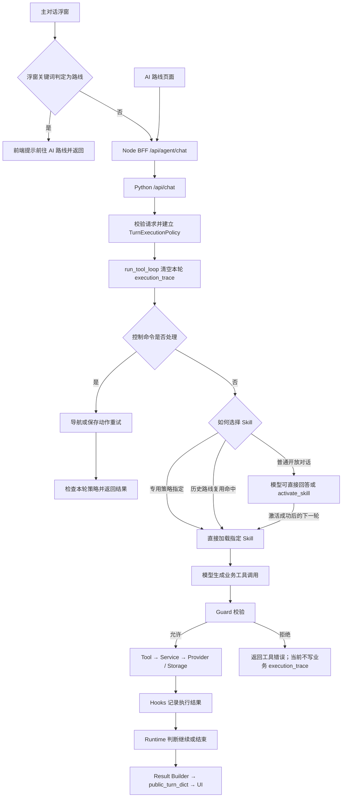
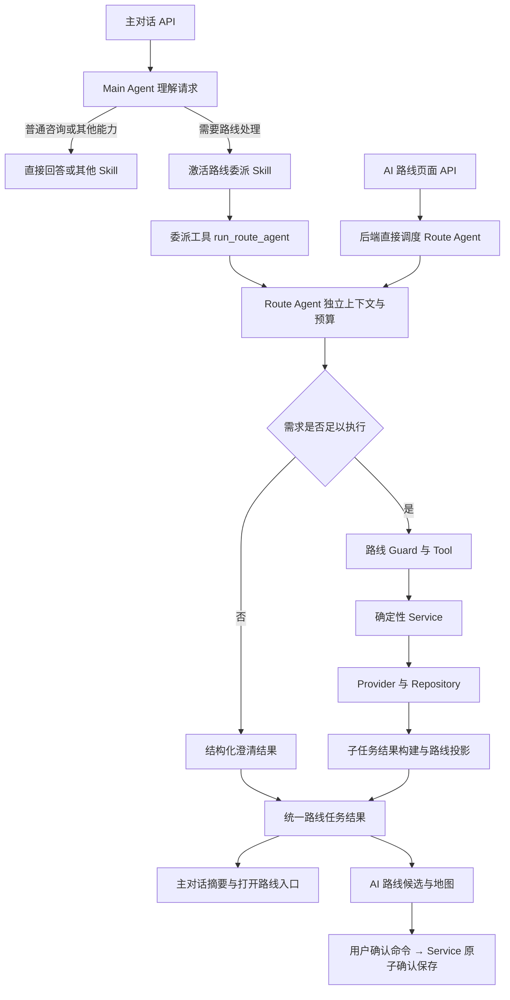

# Agent 流程检查报告

检查日期：2026-09-15。分支：`develop`。基线提交：`a0f862f`。

检查对象为该提交之上的当前未提交实现，包含新增的 `execution_policy.py`、`provider_error.py` 及初次检查时已存在的重试修正。本报告评估用户提供的架构分析，不修改业务代码，也不替代冻结的[最终架构文档](rider-final-architecture-and-python-migration.md)。

本次文档修订纳入用户明确的产品目标：**主对话识别路线意图后委派路线子 Agent；AI 路线页面直接进入同一个路线子 Agent。** 第 3—5 节记录已检查实现，第 7 节保留初次检查的验证记录，第 8—11 节比较候选结构并给出设计建议；设计建议尚未实施。

2026-09-18 进展：本文下述流程与问题是检查时点快照；失败出口、独立 Route Agent、主对话委派和草稿接续的当前状态见 [实施记录](route-agent-implementation.md)。deadline、取消和持久化失败候选恢复仍属于后续切片。

## 1. 结论

原分析关于职责分层、小范围契约收敛和保留确定性业务层的判断成立。但“Policy 只适合已确认请求”和“入口强制 Skill 本身就是意图耦合”需要修正。

更准确的原则是：**开放对话由模型选择能力；任务域和操作已经由产品契约确定的请求，可以由入口限定能力和完成条件；参数解释仍可交给模型。** 请求使用自然语言还是 JSON，并不能单独决定是否允许使用执行策略。

初次源码与测试核对发现：

- Guard 当前已经没有承担路线/活动意图识别；这是应保持的边界，不是需要迁出的现有职责。
- 默认聊天策略已经不强制工具。普通对话中的路线特例来自历史 Skill 自动复用，而非 `forced_skill_id` 本身。
- 重试绕过当前工具要求、不可重试错误被记录为重放动作、高德错误被当成地点不存在，这三项在最新工作区已有修正。
- 输出尚未完全统一：Guard 拒绝、模型初始化失败、无结构化错误码的工具失败仍存在信息丢失；UI 也尚未完整消费错误字段。

结合补充的产品目标，推荐收敛到“主对话委派 + 专用页面直达 + 共用路线子 Agent”。这是可行的能力边界调整，可以复用现有 Runtime、路线 Service、Provider 和 Repository，不需要重写 Main Agent 或大规模迁移目录。专用入口强制 Skill 在现有实现中可以成立，但不意味着必须长期让 Main Agent 承担全部路线工具循环。

## 2. 对原分析的逐项判断

| 原判断 | 评价 | 修正或补充 |
| --- | --- | --- |
| API → Loop → Skill → Tool → Service → Provider/Storage → Result Builder → UI 的分层合适 | 成立 | 这是逻辑职责图；实际执行还经过 Runtime、Guard 和 Hooks，存储也会在结果投影阶段被读取。 |
| Skill 负责能力和工具集合 | 成立 | 工具权限由静态 catalogue 和 Guard 落实，不能由 Skill 文案或模型自行扩大。 |
| 可信入口直接指定 Skill 不合理 | 过于绝对 | 专用“生成路线草稿”入口已经确定任务域，可以跳过通用 Skill 选择；这不会消除模型对地点、偏好和参数的解释工作。 |
| Policy 应为可选执行约束 | 成立 | 可以所有回合都有 Policy 对象，但默认 `chat()` 是无强制要求的策略。对象存在不等于所有请求都被强制路由。 |
| Policy 只用于已确认的结构化动作 | 需要澄清 | 应理解为操作语义明确，不能理解为必须先确认最终路线。生成草稿与确认保存是不同动作。 |
| Guard 只做执行前置检查 | 成立且当前基本如此 | `selected_activities` 是数据前置条件，不是用户意图标签；是否允许调用还需检查工具白名单和类别。 |
| `activate_skill` 是 Skill 选择入口 | 对开放对话成立 | 专用请求可由服务端选择 Skill。两者应共享能力加载/校验规则，无需强迫所有请求多调用一次模型。 |
| 正常执行和重试已经统一 | 部分成立 | 指定必需工具的重试现在经过 `build_completed_result()`；普通重试仍走 `build_turn_result()`，若干控制出口直接构造 `TurnResult`。 |
| 所有失败都保留 provider/stage/code/retryable/message | 方向成立 | `provider` 对 Guard 拒绝等本地失败应为空或省略，不能为凑齐字段虚构 Provider。 |
| 不需要重构目录或重写 Main Agent | 成立 | 当前优先事项是统一语义和边界测试。 |

## 3. 当前真实调用流程

### 3.1 开放对话与专用产品请求



这张图是当前实现的主要分支概览，未展开 capability 检查、每个异常和下一轮循环。浮窗命中路线关键词时没有进入后端；后端具备路线 Skill，并不等于主对话产品入口已经支持路线执行。

源码入口：

- [主对话浮窗](../src/ui/agent/agent-floating-window.js)：`inferPromptKind()` 用关键词分类，`sendMessage()` 对 `route` 直接返回引导文案；正常返回路径主要消费 `answer` 和 `presentations`。
- [浏览器路线请求](../src/app/services/agent-route-preview-service.js)：根据是否存在草稿传递 `request_mode=route_plan` 和 `route_action=create/update`。
- [Node 请求规范化](../src/server/routes/agent-routes.js)：校验并传递显式模式。
- [Python chat_endpoint](../services/training-agent/app/api.py)：建立策略，将模式和动作加入幂等指纹。
- [run_tool_loop](../services/training-agent/agent/main_agent/loop.py)：初始化回合、处理控制命令、选择能力并运行循环。
- [execute_tool_loop](../services/training-agent/agent/runtime/loop_engine.py)：执行模型/工具轮次，维护工具调用与结果的消息配对。

### 3.2 需要区分三种请求

下表描述合理的请求契约，不代表当前浮窗已实现所有路径。

| 请求 | 示例 | 合理路径 |
| --- | --- | --- |
| 开放对话 | “最近训练怎么样？”“路线规划有什么限制？” | 模型选择 Skill 或直接回答；不强制业务工具。 |
| 专用的语义命令 | 在生成路线入口输入“京都附近 30 km 环线” | 入口确定路线任务，模型解释参数；可要求产生路线工具结果。参数不足时需有澄清/参数错误出口。 |
| 参数齐全的确定性命令 | 确认 `plan_id`、`candidate_id`、`expected_revision` | 直接进入命令 Service，不必再请求模型生成一次相同动作。 |

项目已经存在路线选择/确认的 `/api/agent/route-plans/*` 路径。因此原分析提出的强制 Policy 旁路适用于仍需语义解释的请求，不应把所有确定性按钮操作再送回 LLM。

“生成草稿”表示用户要求得到候选；“确认保存”表示用户接受某个候选。二者不得因都属于路线任务而合并授权。

## 4. 关键职责核对

### 4.1 Policy、Skill 和 Guard

[TurnExecutionPolicy](../services/training-agent/agent/main_agent/execution_policy.py) 当前使用以下字段：

```python
request_mode
forced_skill_id
required_tool_name
stop_on_required_tool_failure
```

这与前期讨论中的 `require_tool_call`、`required_terminal_tools` 不是同一份接口；报告应以当前字段为准。

- Policy 定义本轮完成条件，例如必须成功执行 `update_route_plan`。
- Skill 定义工具能力及任务指导。
- Guard 校验本次工具调用是否满足白名单、类别和前置条件。
- Service 校验业务参数、目标对象、约束和保存条件。

指定 Skill 不能豁免 Guard；工具名正确也不代表参数、目标计划或 revision 正确。后者仍应由业务层校验。

[guard.py](../services/training-agent/agent/main_agent/guard.py) 没有读取用户文本来判断路线或活动意图。它通过 `TOOL_DEPENDENCIES` 和传入的 `has_resolved` 检查活动依赖，并不在此函数内直接验证 `selected_activities` 的内容。因此还要保证 `has_resolved` 的维护与实际选择状态一致；不能把这层检查当作活动对象有效性的完整证明。

### 4.2 历史 Skill 自动复用才是当前显式的意图捷径

[should_continue_route_skill](../services/training-agent/agent/main_agent/turn_policy.py) 同时读取最近 Skill、中文动作/路线关键词及数据库中的最新计划。即使使用默认 `chat()`，命中后仍会跳过 `activate_skill`。

这与“普通请求都回到模型选择 Skill”的目标不一致。若采纳该目标，应优先调整这条捷径，例如将历史 Skill 降为提示上下文。不要为了统一开放对话而移除专用入口合理的强制策略。

同时要区分两个规则：

1. 普通对话可以不调用工具。
2. 没有执行证据时，不应声称已修改、保存或上传。

当前 `test_explicit_route_followup_reuses_recent_skill_without_becoming_a_required_action` 用纯文本“已更新路线。”作为 completed 的预期结果。这证明默认策略允许直接回答，但并没有证明回答中的执行声明可信。应保留纯咨询路径，并单独约束关于业务副作用的成功展示；不建议再用路线关键词正则补一套意图分类。

### 4.3 execution_trace 是本轮证据，不是持久化业务事实的替代品

本轮开始前清空 `execution_trace` 已落实，可以避免模型初始化失败时混入旧回合结果。

正常业务工具由 [Hooks](../services/training-agent/agent/main_agent/hooks.py) 记录结果；[保存动作重试](../services/training-agent/agent/main_agent/saved_action.py) 自行构建 `ToolExecution`，没有经过 `post_tool_use()`，但开始共用失败记录和结果构建逻辑。

两个边界需要明确：

- 工具的 completed 应建立在业务校验和必要保存已经完成的基础上。
- trace 只能证明本进程本回合记录了什么；路线真实状态、并发版本和进程重启后的恢复仍由 Repository、revision 和幂等机制负责。

当前 Result Builder 会根据执行结果中的 `plan_id` 再读取 Repository 并生成路线视图。因此不能把整体执行简单理解成完全单向、只消费 trace 的流水线。

## 5. 已修复项与剩余问题

### 5.1 最新工作区已修复或已覆盖的边界

| 项目 | 当前证据 |
| --- | --- |
| 新回合初始化失败夹带旧 trace | `run_tool_loop` 提前清空记录；已有初始化失败回归测试。 |
| 读取旧计划满足创建请求 | Policy 绑定具体必需工具；已有读取旧计划不能完成 create 的测试。 |
| 必需工具失败后继续调用 | Hooks 设置停止标志，Runtime 结束本轮；已有同类测试。 |
| 重试无视当前 create/update 要求 | `turn_control` 比较历史动作与当前必需工具，不匹配时不直接重放；已有跨动作测试。 |
| 成功重试缺少 route_plan | 重试接入结果投影；已有成功路线重试测试。 |
| 不可重试错误仍保存为重放动作 | Hooks 改用 `remember_failed_action`；已有 `retryable=false` 测试。 |
| 高德错误响应被当作无 POI | 文本检索和备用检索均先执行 `validate_amap_response`；初次检查的独立探针验证凭据错误与限流分类。 |

这些结论针对当前未提交代码，不表示相应改动已提交或部署。

### 5.2 仍需收敛的问题

**A. Guard 拒绝没有成为公开可诊断结果。**

Runtime 会把 guarded 错误交回模型，但 `on_blocked()` 只设置停止标志，不写业务 trace。公开结果最终可能是 `action_not_executed` 且 `executions=[]`。现有测试也明确断言该结果。

不应把“模型没调用”与“调用被 Guard 拒绝”混为一类。可以增加独立的调用尝试/决策记录，或使用明确的 blocked 状态，但不能将 blocked 记录当作实际执行，更不能让它进入自动重试队列。

**B. 模型故障仍会被策略未满足覆盖。**

`build_activation_unavailable_result()` 和 `build_llm_unavailable_result()` 在策略未满足时转入统一缺动作处理。当前独立探针得到：模型初始化失败 → `action_not_executed`、0 条执行。

“要求未满足”是结果，不足以描述原因。应分别保留模型未发起调用、模型连接失败、Guard 拒绝、工具失败、预算耗尽等原因。

**C. 通用 Result Builder 仍硬编码路线语义。**

`build_policy_unsatisfied_result()` 固定使用 `route_advice`、`route_rejected` 和路线文案。若未来把相同策略用于活动分析或同步，会返回错误的领域说明。可以保留通用的策略完成判定，将领域错误文案和路线投影放到明确的适配边界，无需现在做大规模注册框架。

**D. 错误字段到达 API，并不等于 UI 已经正确展示。**

[public_turn_dict](../services/training-agent/agent/runtime/models.py) 已保留执行记录中的 `code/provider/stage/retryable/message`，但 [parseAgentRouteDraft](../src/domain/route/agent-route-contract.js) 在缺少路线时主要把 `answer` 包装为普通 Error。

聚合路线 Provider 失败又使用统一的“路线服务暂时不可用，请稍后重试”。因此用户未必能区分 Google 地点检索连接失败、上游凭据错误或其他失败。应投影经过筛选的用户可见错误信息；不要把原始请求、密钥、完整工具参数作为错误详情下发。

**E. “工具集合可用”与“完成声明可信”仍需分别验证。**

Policy 检查具体工具是否成功，但并不证明该工具真的修改了正确对象。Service 需保证 plan ID、revision、操作类型和业务输出一致；普通聊天的文字完成声明也不能自动成为 UI 成功状态。

**F. 逻辑分层合理不代表进程迁移已完成。**

当前主 Agent 和路线规划仍有同步 HTTP 路径。冻结架构要求后续将耗时任务与基础 Web API 隔离到 Worker。本次契约修正可以独立推进，但不能据此宣称整个最终部署架构已经落实；也不应在本报告任务中顺手迁移 Worker 或删除 Node。

**G. 主对话产品入口尚未开放路线执行。**

浮窗的前端路线分支直接返回，没有交给 Main Agent 识别或委派；同时，发送入口以 `activity_analysis` capability 控制可用性。若开放路线能力，需要分别处理通用对话可用性与具体能力可用性，避免活动分析不可用时连带屏蔽路线。

仅删除拦截还不够：当前 AI 路线页面用独立的 `currentDraft` 管理候选，主对话的结构化路线结果还需要通过应用层接入同一预览/编辑流程。

## 6. 建议的收敛顺序与验收条件

1. **先明确入口语义。** 通用聊天、路线命令面板和参数齐全的按钮命令分别建立契约；明确路线面板是否支持纯咨询。操作未知时允许模型选择或澄清，不能只因有旧草稿就把任意文字解释为更新。
2. **再明确能力选择规则。** 开放对话使用模型选择；专用入口保留显式执行约束。采用第 8 节方案 B 后，Main Agent 的路线 Skill 负责提供委派能力，具体路线执行策略由子 Agent 承接，历史关键词捷径不再决定路线工具权限。
3. **统一失败和完成出口。** 正常、重试、Guard 拒绝、模型故障、预算耗尽都保留本轮原因；没有调用过 Provider 时不填写虚构的 provider。
4. **补 UI 错误投影。** UI 消费结构化结果，不依靠解析错误文案判断类型；生成草稿与确认保存继续分离。
5. **用跨模块时序测试验收。** 优先覆盖下表，不以重命名字段或目录整理作为完成标准。

| 测试场景 | 应验证的行为 | 初次检查状态 |
| --- | --- | --- |
| 普通问候，不调用工具 | 正常回答，不强制 Skill/业务动作 | 已有测试通过 |
| 明确 create，但只读取旧计划 | 不能完成 create，不能投影旧路线作为新结果 | 已有测试通过 |
| 必需工具出现结构化 Provider 错误 | 保留错误分类，本轮停止，不伪报成功 | 已有测试通过；UI 展示仍需补齐 |
| 候选被业务规则拒绝 | 保留业务拒绝类别，不伪装网络失败 | 当前结构化分支已存在，需继续覆盖多原因聚合 |
| 正常与重试均成功 | 返回对应计划和版本，满足本轮策略 | 已有测试通过 |
| 历史 update 失败，本轮要求 create | 不直接重放 update | 新增测试通过 |
| 不可重试失败 | 不保存直接重放动作 | 新增测试通过 |
| Guard 拒绝 | Handler 未执行，公开结果保留拒绝原因 | Handler 不执行已有覆盖；公开原因缺失 |
| 模型初始化失败 | 无旧 trace；明确模型故障原因 | trace 清理已覆盖；原因分类仍需修正 |
| 普通咨询与执行成功声明 | 可以直接回答，但不能凭文本宣告业务已修改 | 当前测试未保证该边界 |
| 所有必需参数已经结构化 | 直接 Service 命令，不无故增加模型轮次 | 路线选择/确认已有直接接口，应保持 |

## 7. 初次检查验证记录

以下为初次生成报告时在 `services/training-agent` 目录执行的记录，**本次结构方案文档修订未重跑这些测试**，也不能用这些结果证明尚未实现的子 Agent 方案：

```bash
python3 -m pytest -q \
  tests/test_tool_loop.py \
  tests/test_result_builder.py \
  tests/test_route_provider_contracts.py \
  tests/test_single_day_route_plan.py \
  tests/test_api.py \
  tests/test_architecture.py
```

结果：**137 passed in 29.56s**。测试使用仓库现有的临时数据隔离 fixture。

另以 mock Provider 响应和内存 Context 执行独立探针，结果如下：

```text
model_initialization_failure: action_not_executed 0
INVALID_USER_KEY: ProviderError provider_rejected False
QPS_HAS_EXCEEDED_THE_LIMIT: TransientProviderError provider_unavailable True
```

测试通过意味着当前断言被满足；部分断言本身还保留了 Guard 拒绝原因丢失等现状，不能据此认定设计已经完全闭合。

初次检查未发起真实模型/地图请求，未读取本地配置、运行数据、FIT、Token 或历史日志；未进行浏览器端到端验证，仅新增本报告。

## 8. 路线能力的四种可选结构

### 8.1 比较前先明确三种边界

- **Skill**：任务指导和静态工具集合，激活后通常仍由当前 Agent 的上下文和循环执行。
- **子 Agent**：独立的任务上下文、模型消息、工具边界和执行预算。可以复用同一 Runtime、同一模型配置，甚至在同一进程运行，不要求新增微服务。
- **Job / Worker**：任务持久化、调度、恢复和进程隔离。是否采用子 Agent，与是否采用 Worker 是两个独立决定；包一层子 Agent 不会自动消除 HTTP 阻塞。

目前 `plan-routes` 属于第一种。项目已有[活动分析子 Agent](../services/training-agent/agent/analysis/agent.py) 作为独立会话的参考，但不应机械复制其专用循环或报告存储逻辑。

### 8.2 方案比较

| 方案 | 主对话入口 | AI 路线入口 | 优点 | 代价与适用范围 |
| --- | --- | --- | --- | --- |
| A. 单 Main Agent，多 Skill | 模型激活路线 Skill，直接使用路线工具 | 指定路线 Skill，复用 Main Agent | 改动最小，少一层委派；现有实现最接近此结构 | 路线上下文、预算和结果逻辑容易继续进入 Main Agent；可作为短期方案，但不满足用户希望的独立子 Agent 边界。 |
| B. Main Agent 委派，共用路线子 Agent | 模型选择路线能力，通过委派工具调用 Route Agent | 后端直接调用同一个 Route Agent | 两种入口共用规划逻辑；主 Agent 保留跨领域对话，路线状态集中 | 需要父子结果契约、上下文交接和跨入口计划关联；**最符合当前产品目标，推荐。** |
| C. 对话控制权转交 Route Agent | 检测到意图后切换当前会话的执行者，后续消息直接归 Route Agent | 直接由 Route Agent 接管 | 连续多轮修改不必每轮经过父 Agent 选择 | 必须定义何时退出、如何切回训练分析、如何处理混合意图；适合明确的“路线专用对话模式”，主对话可能变成有模式的界面。 |
| D. 模型解析需求 + 确定性路线工作流 | Main Agent 输出需求，由工作流执行 | 专用解析入口或表单进入同一工作流 | 步骤、重试和完成条件容易测试，减少自由工具循环 | 灵活探索和多轮调整需要显式设计分支；适合任务类型稳定的产品，现阶段完整替换路线 Agent 的改动更大。 |

方案 B 与 C 的区别是控制权：B 中子 Agent 返回后，下一条主对话仍由 Main Agent 理解；C 中会话持续交给 Route Agent，直到明确退出或转交。不能只把函数叫作“子 Agent”，却在行为上隐式切换整个主会话。

方案 D 可以逐步成为 B 的内部实现：Route Agent 解释语义和处理澄清，固定的地点解析、算路、约束过滤、排序和保存仍由确定性 Service 完成。没有必要为了子 Agent 把这些业务步骤全部改成模型选择。

以上性能判断是结构上的取舍，尚无 A/B 测量。B 的主对话入口会增加委派交互，但较窄的子上下文可能降低后续消耗；不能预先承诺更快或更省 Token。AI 路线入口应跳过父 Agent，不额外支付通用意图选择成本。

### 8.3 推荐方案 B 的目标调用图



`run_route_agent` 是建议名称，当前尚无此工具。“直接调度”仍通过现有 Browser → Node BFF → Python API 边界；内部可按请求模式分派，不要求先新增 URL 或提前移除 Node。

## 9. 推荐方案需要明确的契约

### 9.1 父子 Agent 分工与依赖方向

| 层 | 应承担的职责 | 不应转移到这里的职责 |
| --- | --- | --- |
| Main Agent | 理解整条用户请求，选择能力，传递用户原意及必要上下文，展示子任务结果 | 地点解析循环、路线候选排序、根据关键词维护路线执行状态 |
| 主 Agent 的路线 Skill / 委派 Tool | 声明路线委派能力，适配参数并调用 Route Agent | 同时暴露另一套底层创建/修改路径，导致父子重复操作 |
| Route Agent | 路线语义解释、补充澄清、选择路线工具、判断子任务结束 | 重写地图算法、绕过业务约束、凭文字决定保存成功 |
| Route Tool / Service | 参数适配；确定性校验、质量规则、Provider 编排和保存 | 调用 Main Agent 进行反向意图判断 |
| 通用 Runtime / Guard | 工具循环、调用合法性、预算和停止机制 | 通过路线专用关键词分类用户意图 |
| 结果构建与 UI | 统一任务状态，投影路线事实，分别呈现摘要和地图 | 把父 Agent 的叙述当作路线已生成或保存的依据 |

主 Agent 的委派 Skill 和子 Agent 的路线执行工具集应是两个清晰的能力边界；可以复用现有路线指导，避免复制两份业务规则。API 与父级 Tool 都调用 Agent 层入口，Agent 再调用 Service；不能为了两个入口共用而让 `services/route` 反向 import Agent。

子 Agent 可复用 `execute_tool_loop`，但不能通过递归调用完整 Main Agent、共享可变 `AgentContext` 来实现隔离。只传需要的路线状态和用户约束，父子各自维护消息配对与 trace。

### 9.2 路线任务状态与聊天会话分开

建议区分以下身份；字段命名仍需在实现时与现有契约对齐：

| 标识/状态 | 用途 |
| --- | --- |
| `session_id` | 主对话或页面自己的对话历史，两个入口可以不同。 |
| 路线任务标识 | 关联子 Agent 的澄清、继续处理和结果；还没生成计划时也能接续任务。 |
| `request_id` | 标识一次逻辑操作；重发同一操作应复用幂等身份，新修改使用新身份。 |
| `plan_id` / `revision` | 已生成路线及其版本，是跨入口打开、修改和并发校验的业务依据。 |
| `workspace_id` | 由服务端校验的业务归属，不能因为知道一个 plan ID 就绕过归属检查。 |

当前[路线 Handler](../services/training-agent/agent/tools/handlers/route.py) 用 `context.workspace_id or context.session_id` 确定归属，并检查计划所属 workspace。跨入口接续必须显式解决这一映射，不能只在页面 URL 中加 `plan_id`，也不能删除现有归属检查。

主对话中的“继续少左转”应携带已选路线任务引用；若有多个计划且指代不明确，先澄清。打开 AI 路线页面时通过应用层读取指定计划、初始化当前草稿，不重新发起 create。另一个入口已经更新时，用 revision 冲突结果要求刷新，不能把旧草稿无条件覆盖回去。

### 9.3 完成要求与澄清出口

当前 `TurnExecutionPolicy.route_plan()` 在无 trace 时强制首个具体 create/update 工具。这适用于前置条件已经具备的动作，不宜直接作为所有子 Agent 请求的第一步。

建议区分三个层次：

1. **主对话能力选择**：由模型决定是否委派，不因历史路线状态就强制调用子 Agent。
2. **路线需求解释**：允许读取当前计划、回答范围内咨询或返回缺失参数；不把一切输入都解释成修改。
3. **已明确的路线动作执行**：一旦宣告创建或更新完成，必须有对应工具和业务结果作为证据；只读取旧计划不能满足创建要求。

“帮我规划一圈”没有可用地区上下文时，应返回澄清；“把京都这条路线缩短到 20 km”且计划明确时，应执行更新。已有草稿不代表用户不能另建新路线；当前页面按 `currentDraft` 一律选择 update 的规则需要随新产品契约调整。

### 9.4 统一结果与分层 trace

以下是待实现的语义分类，不是当前 API 已支持的字段枚举：

| 结果类别 | 必须表达的事实 |
| --- | --- |
| 已完成 | 实际执行的动作、对应 plan ID / revision、可投影的有效候选；返回旧计划阅读结果时不能声称新建完成。 |
| 需要澄清 | 缺失或歧义信息、给用户的问题、可接续的任务引用；这不是 Provider 失败。 |
| 执行被拒绝 | Guard 或 Service 拒绝的阶段与原因；Handler 未执行时不能记录为工具已执行。 |
| 外部或模型故障 | `code`、`stage`、`retryable`、可读说明，适用时附 `provider`；保留原因链。 |
| 未执行、超时或取消 | 区分没有发起动作、已开始但结果未知、已确定取消；不能统一展示为“模型没有调用工具”。 |

有候选成功而其他候选失败时，应保留可用候选及拒绝详情，不把整批重新当作失败执行。新公开结果字段或持久化子任务协议需要按项目规则版本化，普通内部返回值无需机械新增 schema。

父 trace 记录一次委派及子任务引用，子 trace 记录实际路线工具事实，二者通过调用标识关联。父级委派函数返回不等于路线成功；父级必须检查子结果分类，而非只判断“没有抛异常”。业务路线投影保持一个权威实现，父子只分别适配自身输出，不重新计算候选或业务成功状态。

父 Agent 可以生成摘要，但即使摘要模型失败，已经保存的路线结果也应可展示。主对话路线卡片读取结构化结果，不能被父级文字改写为另一条路线；明确结果可以直接投影，不必强制多跑一轮模型总结。

### 9.5 重试、取消与预算

增加子 Agent 会增加调用边界，因此要在设计阶段明确：

- Provider 层仅在限定范围内重试可恢复的请求；父 Agent 不因子任务报错就无条件重复委派，防止重试次数在多层相乘。
- 子 Agent 使用明确的时间和工具调用预算，并受父请求剩余期限约束；Provider 超时也受这个期限限制，不能每进入一层重新获得完整预算。
- 若保存后响应丢失，先按任务/请求标识查询结果，再决定重试；`retryable=true` 不意味着可以忽略副作用状态和 revision 直接重放。
- 关闭 UI 或忽略过期响应不等于后端取消成功。取消信号需要传播；来不及停止的操作仍需保留可查询结果，并防止迟到响应覆盖新草稿或骑行中的路线。

迁入 Worker 时沿用同一个子任务契约，补充持久化运行状态和恢复。子 Agent 拆分本身不修复 Google TLS 握手不稳定，也不代表主 Agent / 路线已完成 Worker 迁移。

## 10. 建议实施顺序与验收场景

### 10.1 按可独立审查的切片推进

1. **定义两个入口共用的路线任务输入/结果。** 明确地区、路线类型、计划引用、归属、版本、澄清和错误；主对话应显式传递与 AI 路线页面一致的 Rider 虚拟路线约束，例如无海拔设置，避免入口不同导致默认业务行为不同。
2. **建立 Route Agent 入口。** 复用 Runtime、Service、Provider、Repository；先验证独立调用的成功、澄清、故障和修改，不引入新的多 Agent 框架。
3. **让 AI 路线入口直接调用该入口。** 可保留现有 HTTP URL，在后端分派；结果适配同时支持澄清和候选，不能一律因缺少 `route_plan` 抛错。
4. **接入 Main Agent 委派。** 路线 Skill 只暴露受约束的委派能力，移除前端业务关键词拦截和后端历史路线直接执行捷径；分离通用对话与具体能力的可用性检查。
5. **打通计划接续和 UI。** 主对话返回路线卡片，AI 路线页面读取指定草稿，复用原有预览与确认命令；处理两个入口并发修改、迟到响应和骑行中的编辑限制。
6. **收敛重试和部署。** 删除被替代的重复路线执行路径，沿统一结果契约完善 deadline、取消和恢复；Worker 迁移作为明确的后续切片，不混入本次文档改动。

迁移期间可保留旧路径用于兼容，但同一次请求只能有一个执行 owner。不得父 Agent 执行 create 后又委派子 Agent create，或 UI 收到结果后再次自动规划。

### 10.2 新结构的跨入口验收矩阵

以下均为建议补充的验收要求，尚未执行：

| 场景 | 可观察的验收条件 |
| --- | --- |
| 主对话说“帮我规划京都 30 km 环线” | 请求到达 Main Agent，经 Skill 委派路线子任务；返回可打开的真实草稿，不只显示去路线页面的提示。 |
| 主对话说“路线规划支持哪些功能” | 允许直接回答或只读咨询，不因出现路线关键词就创建草稿。 |
| AI 路线页面提交同类规划需求 | 直接调用 Route Agent，不运行 Main Agent 的通用 Skill 选择；输入约束、业务校验与主对话委派路径一致，不要求模型产生完全相同的几何。 |
| 缺少地区，随后用户补充 | 首轮返回澄清且不盲目算路；后续接续同一子任务，不串到其他路线。 |
| 主对话生成后打开 AI 路线 | 加载同一 plan ID / revision，不再次创建；地图候选与主对话卡片引用一致。 |
| 修改“少左转” | 保留未否定的途经点，更新偏好并真实重算/排序；不是只修改候选名称。 |
| 存在草稿时明确要求另建路线 | 识别为新任务，不无条件 update 旧草稿。 |
| 两个入口修改同一版本 | 后提交的过期 revision 被拒绝或明确要求刷新，不覆盖先完成的修改。 |
| Google 失败或候选全被拒绝 | 父子结果保留不同错误原因，两个 UI 都能展示；父 Agent 不伪报成功。 |
| 部分候选失败 | 成功候选保留并可预览，不整批重复规划。 |
| 保存后响应丢失或父级摘要失败 | 可按请求/计划查询已生成结果，不重复创建或确认。 |
| 用户取消或骑行已经开始 | 取消状态与实际执行状态区分；迟到结果不覆盖新请求或当前骑行路线。 |
| 活动分析不可用但路线可用 | 主对话不因活动分析 capability 而整体禁用，路线能力仍可按自身条件处理。 |
| 从路线话题转到训练分析 | 主对话下一轮仍能选择其他 Skill；子 Agent 的工具权限和消息历史不泄漏到父会话。 |
| 预览后确认保存 | 仍经已有明确确认命令和业务校验；生成草稿不等于接受候选或保存为最终路线。 |

性能验证另行比较主对话委派和 AI 路线直达的模型调用次数、输入/输出 Token、总耗时、Provider 耗时与最终质量。先用确定性 mock 验证调用边界，再独立报告真实网络结果。

## 11. 本次文档修订范围

本次只更新本报告：补正当前浮窗拦截的流程图，区分当前实现与用户目标，比较四种结构，并补充推荐子 Agent 方案的契约、实施切片和验收条件。未修改业务实现、测试、ADR 或冻结架构，也未将上述方案记作已落地。

本次仅核对相关源码与文档，执行 Markdown 本地链接、代码围栏和空白检查；未重跑业务测试、未发起模型或地图请求。第 7 节的 137 项通过是初次检查记录。
