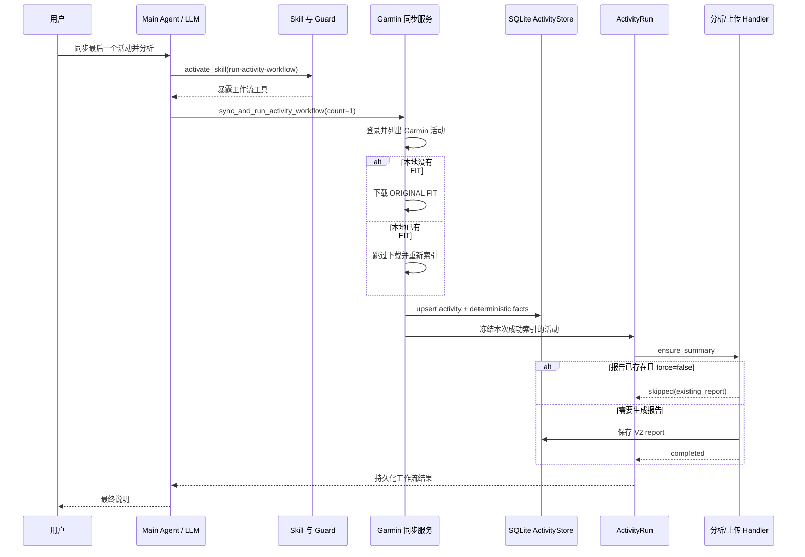

# Garmin 同步与活动工作流学习指南

本文从一次“同步 Garmin 最后一个活动并分析”的请求出发，说明 Personal FIT Agent 中各模块的职责、数据边界、持久化状态、失败恢复和测试方法。

## 0. 项目全景

这个项目不是“把所有数据塞给大模型”，而是把一次请求拆成五层：

```text
用户语言
  → Main Agent 判断意图并激活 Skill
  → Tool Handler 调用确定性领域服务
  → SQLite / ActivityRun / RoutePlan 保存真实状态
  → Presentation 投影结构化展示
  → Result Builder 生成本轮文本答复
```

目前的主要能力可以分为四条路径：

| 能力 | 核心入口 | 确定性数据 | 模型的职责 |
| --- | --- | --- | --- |
| 单活动分析 | `agent/analysis/agent.py` | FIT 解析、facts、已存报告 | 解释训练意义 |
| 历史查询与趋势 | `agent/analysis/query.py` | SQLite 索引和紧凑查询结果 | 围绕用户的具体问题归纳 |
| Garmin/Strava 工作流 | `operations/activity/` | FIT、ActivityRun、task outcome | 选择目标和粗粒度动作 |
| 路线规划 | `services/route/` | RoutePlan、候选线路、几何和海拔 | 提出途经点、比较候选和理解修改指令 |

### 两条最重要的设计边界

1. 大模型看紧凑的结构化摈要，不应反复接收整个 FIT 时序或路线坐标。例如 `compact_route_plan()` 会移除大型几何和海拔数组，完整数据留给本地展示层。
2. 文本答复不是事实库。已经下载、已经分析、上传是否成功、路线当前 revision，都必须从持久化结构和本轮工具轨迹得出。

### 会话和持久化不是一回事

`AgentContext` 保留多轮对话的当前活动、已选活动和消息；`app/chat_sessions.py` 目前是进程内会话存储，有 TTL 和容量上限，重启进程后不保证恢复。ActivityStore、ActivityRun 和 RoutePlanStore 才是跨进程的业务状态。

因此，“会话续聊”和“业务不重复执行”要分别设计：前者依赖 Context 恢复，后者依赖数据库、workflow ID、request ID 和幂等规则。

## 1. 先理解三个不同动作

### 只同步

用户只要求下载或同步时，Agent 激活 `sync-garmin-activities`，调用 `sync_garmin_activities`。

它负责：

- 登录 Garmin 中国区；
- 拉取最近 N 条远端活动；
- 下载本地没有的原始 FIT；
- 解析并写入本地活动目录；
- 到此结束，不生成分析报告。

### 同步并处理

用户要求“同步后分析、汇总或上传”时，Agent 激活 `run-activity-workflow`，调用 `sync_and_run_activity_workflow`。

它先完成同步，再把本次成功索引的活动冻结成一个 ActivityRun 快照，然后执行报告生成、聚合或 Strava 上传任务。

### 只处理本地活动

活动已经在 SQLite 中，用户没有要求访问 Garmin 时，使用 `run_activity_workflow`。不要为了分析本地文件再次同步 Garmin。

## 2. 总体时序



## 3. 模块与职责

| 层次 | 主要文件 | 职责 |
| --- | --- | --- |
| Main Agent | `agent/main_agent/loop.py` | 管理每轮消息、Skill 激活、模型与工具循环 |
| Tool Adapter | `agent/tools/handlers/activity_operations.py` | 把模型参数转换为确定性服务调用，并更新当前活动焦点 |
| Tool Contract | `agent/tools/agent_tools.py` | 定义模型能看到的工具说明和输入 Schema |
| Garmin Adapter | `integrations/garmin.py` | 登录、列活动、下载 ORIGINAL 文件、原子落盘 |
| Sync Service | `operations/activity/service.py` | 跳过或下载 FIT，并完成本地索引 |
| Sync Normalizer | `operations/activity/sync.py` | 把底层结果整理成稳定的 completed/partial/failed 契约 |
| Activity Store | `storage/repositories/activity.py` | 保存活动、确定性 facts、分析报告和远端身份 |
| Workflow Factory | `operations/activity/workflow_factory.py` | 冻结活动集合并建立任务依赖图 |
| Workflow Runtime | `operations/runtime/*` | 管理 pending/running/completed/skipped/failed 状态迁移 |
| Workflow Service | `operations/activity/workflow_service.py` | 创建、读取、加锁执行和重试 ActivityRun |
| Result Builder | `agent/main_agent/result_builder.py` | 把当前轮执行轨迹转换成用户可见结果 |

核心原则是：LLM 只负责理解用户目标和选择粗粒度工具；下载、去重、任务状态、报告复用和重试必须由确定性代码负责。

## 4. 活动的三种身份

### Garmin 远端身份

`source="garmin_cn" + source_activity_id` 表示 Garmin 上的同一条活动。它用于识别“远端还是同一条活动”。

### FIT 内容身份

`activity_key` 是 FIT 内容哈希。文件内容变化时，key 也会变化。这样报告不会错误复用到已经改变的数据上。

### 本地路径身份

`fit_path` 指向实际文件。普通同步发现匹配文件时跳过下载，但仍可重新解析和索引。

强制刷新同一条 Garmin 活动后，应按 `source_activity_id` 删除旧内容身份及其派生报告，再安装新内容身份，避免同一远端活动在本地出现两条记录。

## 5. 普通同步与强制刷新

| 用户意图 | `force_download` | 行为 |
| --- | --- | --- |
| 手机新增了一条活动 | `false` | 正常查询最近活动，新 ID 会自动下载 |
| 再同步一次看看有没有新活动 | `false` | 已有 FIT 跳过，新活动下载 |
| Garmin 上同一条活动被裁剪或修改 | `true` | 重新下载已有活动的原始 FIT |
| 只修改了活动标题但不需要刷新数据 | 通常 `false` | 不应无意义重下 FIT |

`force_download` 只控制 FIT 下载。`force` 控制是否重新生成已有分析报告，二者不要混淆：

```text
force_download = 刷新源数据
force          = 刷新派生报告
force_upload   = 重新执行 Strava 发布语义
```

## 6. ActivityRun 为什么存在

同步、分析和上传可能耗时很长，也可能在任何一步断线。ActivityRun 把一次请求变成可持久化任务图：

```text
ensure_summary(activity A)
    ↓
upload_strava(activity A)

ensure_summary(activity B)
    ↓
upload_strava(activity B)

aggregate_report 依赖多个 ensure_summary
```

每个任务都有状态和尝试次数。执行器在状态变化后立即保存检查点，因此进程退出后仍能审计已经发生了什么。

ActivityRun 冻结的是“本次处理哪几条活动”，但 Strava 远端身份属于可变化的业务状态。同步结果转成 Run 时会按精确的 `activity_key` 从 SQLite 补齐 `strava_activity_id`；真正上传前还必须再次读取 SQLite。这样另一个 Run 已完成上传后，旧快照也会确定性跳过，而不会再次发送上传请求。

如果 FIT POST 已返回 `upload_id`，但随后查询处理状态时发生 TLS/网络错误，失败任务会保存该 `pending_upload_id`。显式重试只继续轮询这个 upload，不重新 POST FIT；取得最终 `activity_id` 后再写回 SQLite。

最终说明按活动标注每个 `ensure_summary` 和 `upload_strava` 结果，并区分新报告、复用报告、新上传、Strava 重复活动、已知远端活动和失败。不能把多个活动的任务压成无法对应来源的泛化句子。

### 为什么需要锁

两个执行器同时推进同一个 Run 可能重复上传或重复分析。正确顺序是：

```text
获取文件锁
  → 重新加载最新 Run
  → 判断 running 是否为崩溃残留
  → 恢复/重试任务
  → 在同一把锁内继续执行
```

不能在拿锁之前把 `running` 直接判成失败，否则另一个仍在工作的进程会被误判。

## 7. 报告复用语义

`ensure_summary` 表示“保证报告存在”，不等于“每次重新分析”。

- 已有报告且 `force=false`：任务为 `skipped`，reason 为 `existing_report`；
- 没有报告：生成 V2 报告并保存；
- 明确要求重新分析：传 `force=true`。

一个全部由 `skipped` 组成的工作流仍可以是 `completed`，因为用户要求的最终条件已经满足。展示层必须同时说明“工作流完成”和“报告被复用”，不能把 skipped 写成新分析。

### 完整报告为什么不再经过 Main Agent

`analyze_activity` 和 `query_activity_detail` 等终结工具的 `answer` 已经是可直接展示的用户结果。它们成功返回非空 `answer` 后，工具循环直接结束，不再请求 Main Agent 复述一次。

```text
Activity Analysis Agent / 确定性查询
  → terminal tool.answer
  → Result Builder 加上执行标题
  → 直接展示
```

这条规则有三个作用：保留完整证据，避免 Main Agent 把详细报告压缩成一句话，并节省一次主模型请求。只有工具没有返回完整 `answer`、多个中间结果仍需整合，或失败需要解释时，才进入 Main Agent 的最终组织轮。

## 8. AgentContext 与轮次边界

`AgentContext` 同时保存长期会话状态和本轮诊断状态：

- `selected_activities/current_fit_file`：后续“这个活动”指向谁；
- `last_tool_result`：最近一次业务工具结果；
- `execution_trace`：本轮执行轨迹；
- `last_llm_error`：最近模型连接错误。

必须区分“最近一次”和“本轮”。模型在新一轮调用工具前断线时，`last_tool_result` 仍可能属于上一轮。因此断线降级只能根据本轮 `steps + execution_trace` 判断是否已经完成工作流，不能直接拿长期状态生成“本轮已完成”。

同步成功后也必须把本次活动写入 `selected_activities`。否则新活动虽然已经下载，后续“分析这个活动”仍可能指向旧 FIT。

## 9. 错误分类

| 阶段 | 示例 | 应对外表现 |
| --- | --- | --- |
| Garmin 登录/列表 | 凭据失效、网络错误 | `failed`，未创建工作流 |
| 单条下载 | ORIGINAL 暂不可用 | `partial`，保留其他成功活动 |
| FIT 解析/索引 | 文件损坏、SQLite 写入失败 | `partial/failed`，暴露 `index_errors` |
| 报告生成 | LLM 或分析失败 | ActivityRun `partial`，任务可重试 |
| Strava 上传 | TLS、权限、重复活动 | 保存真实 task outcome，避免盲目重放 |
| 最终说明 | 工具完成后 LLM 断线 | 用本轮结构化结果生成确定性说明 |
| Skill 激活前断线 | 尚未执行任何工具 | 明确说本轮没有同步，不得引用旧 Run |

## 10. 测试应该分四层

### 纯函数和存储单测

- 本地文件跳过；
- `force_download` 重新下载；
- 同一 `source_activity_id` 替换旧内容 key；
- 索引错误进入 partial/failed；
- 报告随旧内容记录一起失效。

### 工作流集成测试

- 本次索引集合被精确冻结；
- 已有报告跳过；
- 分析失败后显式重试；
- 锁竞争不会重复执行；
- 崩溃遗留 running 能在加锁后恢复。

### Main Agent 多轮测试

- 第一轮无新活动，第二轮出现新活动；
- 第二轮必须产生新 workflow ID；
- 当前焦点切到新活动；
- 激活前断线不得显示旧 workflow；
- 工具完成后断线必须显示当前 workflow。

### 模型评测语料

同一意图需要覆盖正式表达、口语、缺少空格、错别字和上下文式表达，例如：

- `同步 Garmin 的最后一个活动并分析`
- `同步garmin的最后活动进行分析`
- `更同同步garmin的最后一个活动进行分析`
- `手机刚同步好了，再拉最后一个活动并分析`
- `Garmin 上最后一条活动的数据改过了，强制重新下载原始 FIT 并重新分析`

语料评测验证模型能否选对 Skill 和参数；它不能替代故障注入和共享 Context 的确定性测试。

## 11. 推荐阅读顺序

1. `agent/main_agent/loop.py`：理解一轮对话怎样运行；
2. `agent/main_agent/hooks.py`：理解工具调用怎样记录和受 Guard 控制；
3. `agent/tools/handlers/activity_operations.py`：理解 Agent 与领域服务的边界；
4. `operations/activity/service.py`：理解 Garmin 下载和索引；
5. `storage/repositories/activity.py`：理解活动、facts 和报告身份；
6. `operations/activity/workflow_factory.py`：理解任务图；
7. `operations/runtime/models.py` 与 `executor.py`：理解状态机；
8. `agent/main_agent/result_builder.py`：理解结果为什么必须来自本轮证据；
9. 对照 `tests/test_tool_loop.py`、`tests/test_activity_workflow_service.py` 和 `evaluation/cases/*.jsonl` 阅读验收条件。

掌握这些模块后，再看路线规划、Strava 发布或批量历史分析，会发现它们遵循同一套设计：模型负责意图，领域服务负责事实，持久化状态负责恢复，结果构建器负责如实展示。
